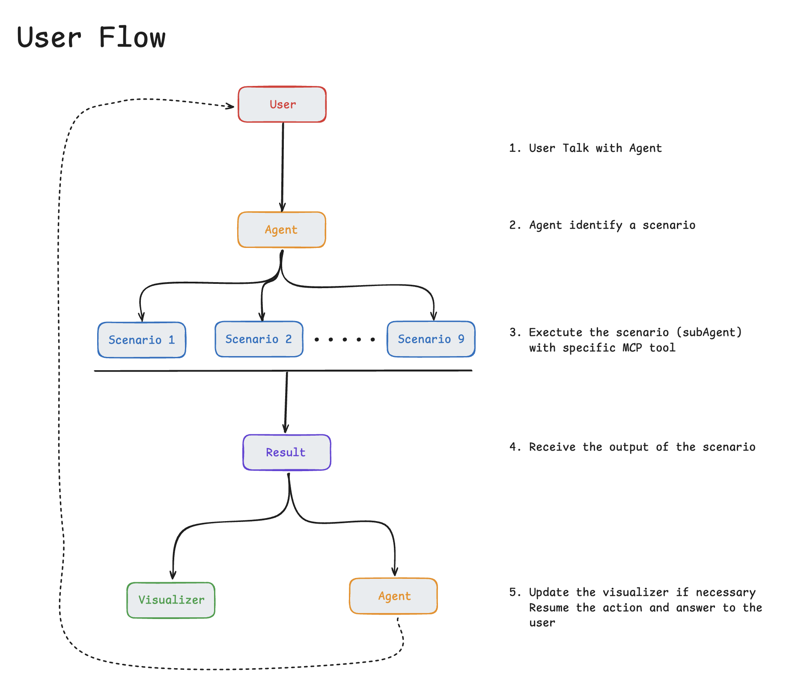

# Grape Backend

> **AI-Powered Knowledge Graph Querying Platform**
> FastAPI backend with MCP pipelines for natural language to SPARQL conversion, powered by gen2kgbot.

[](https://www.python.org/)
[](https://fastapi.tiangolo.com/)
[](LICENSE)

---

## Overview

Grape Backend is a production-ready FastAPI server that enables **natural language querying** of knowledge graphs through an intelligent agent architecture. It combines:

- **9 Reusable MCP Pipelines** - Modular tools for knowledge graph operations
- **9 AI-Powered Scenarios** - High-level workflows for different query types
- **gen2kgbot Integration** - Proven NL2SPARQL conversion engine
- **Google Cloud Ready** - Designed for deployment on Cloud Run with Vertex AI

### What Can It Do?

- **Explore concepts**: "What treatments are associated with protein X?"
- **Find hidden connections**: "Is there a link between gene A and disease Z?"
- **Complex reasoning**: "Which medications for patients >50 years old with condition Y?"
- **Cross-knowledge graph queries**: Link information across multiple KG sources
- **Explainable AI**: See the reasoning path taken to answer each question

### Architecture



```
User Question (Natural Language)
         ↓
    Agent (Orchestrator)
         ↓
  Identifies Scenario
         ↓
Executes MCP Pipelines ──→ gen2kgbot (NL2SPARQL)
         ↓                        ↓
    SPARQL Query          GraphDB/Endpoint
         ↓                        ↓
    Results ←────────────────────┘
         ↓
  Reasoning Path Extraction
         ↓
  Structured Response
```

---

## Features

### 🧠 9 AI-Powered Scenarios

Each scenario orchestrates multiple pipelines to handle specific query types:

1. **Concept Exploration** - Deep dive into a single concept's neighborhood
2. **Multi-hop Reasoning** - Find paths between distant concepts
3. **Adaptive NL2SPARQL** - Context-aware SPARQL generation with examples
4. **Cross-KG Federation** - Query across multiple knowledge graphs
5. **Validation & Proof** - Prove or disprove assertions with evidence
6. **Explainable Reasoning** - Transparent AI with step-by-step explanations
7. **Filtered Exploration** - Queries with complex business constraints
8. **Alignment Detection** - Detect agreements/conflicts between KGs
9. **Decision Synthesis** - Actionable recommendations with traceability

### 🔧 9 Reusable MCP Pipelines

Core building blocks that scenarios compose:

| Pipeline | Purpose |
|----------|---------|
| **Semantic Concept Finder** | Match natural language to KG concepts using embeddings |
| **Neighbourhood Retriever** | Get all direct connections of a concept |
| **Multi-hop Path Explorer** | Navigate N-degree relationships |
| **Ontology Context Builder** | Extract schema/structure information |
| **Example-Based Retriever** | Find similar query examples for few-shot learning |
| **Federated Connector** | Link and query across multiple KGs |
| **SPARQL Executor** | Execute queries with retry logic and error handling |
| **Proof & Validation Engine** | Verify assertions using reasoning |
| **Reasoning Narrator** | Transform execution traces into human-readable explanations |

### 🌐 API Endpoints

- `GET /` - API information
- `GET /api/health` - Health check with dependency status
- `POST /api/graph/{graph_id}/query-agent` - Natural language query endpoint
- `GET /docs` - Interactive API documentation (Swagger UI)
- `GET /redoc` - Alternative documentation (ReDoc)

---

## Quick Start

### Prerequisites

- **Python 3.12**
- **uv** package manager ([install guide](https://github.com/astral-sh/uv))
- **GraphDB** or compatible SPARQL endpoint (optional for testing)

### Option 1: Automated Installation (Recommended)

```bash
cd apps/backend
./install.sh
```

This script will:
- ✓ Install `uv` if not present
- ✓ Create a Python 3.12 virtual environment
- ✓ Install all dependencies from `requirements.txt`
- ✓ Download required Spacy NLP models
- ✓ Create `.env` from template

### Option 2: Manual Installation

<details>
<summary>Click to expand manual setup instructions</summary>

#### 1. Install uv

```bash
# macOS/Linux
curl -LsSf https://astral.sh/uv/install.sh | sh

# Windows
powershell -c "irm https://astral.sh/uv/install.ps1 | iex"
```

#### 2. Set up virtual environment

```bash
cd apps/backend

# Create Python 3.12 venv
uv venv --python 3.12

# Activate
source .venv/bin/activate  # macOS/Linux
# or
.venv\Scripts\activate     # Windows
```

#### 3. Install dependencies

```bash
# Install Python packages
uv pip install -r requirements.txt

# Install pip (needed for Spacy downloads)
uv pip install pip
```

#### 4. Download Spacy models

```bash
# Required models
python -m spacy download en_core_web_sm
python -m spacy download en_core_web_lg

# Optional: Scientific models for biomedical domains
uv pip install https://s3-us-west-2.amazonaws.com/ai2-s2-scispacy/releases/v0.5.4/en_core_sci_lg-0.5.4.tar.gz
```

</details>

### Configuration

```bash
# Create .env from template
cp .env.example .env

# Edit with your credentials
nano .env  # or your favorite editor
```

**Essential variables:**

```bash
# Google Cloud (for Vertex AI)
GOOGLE_API_KEY=your-google-api-key
GCP_PROJECT_ID=your-project-id

# Knowledge Graph SPARQL endpoint
KG_SPARQL_ENDPOINT_URL=http://your-graphdb:7200/repositories/your-repo

# At least one LLM provider
OPENAI_API_KEY=your-openai-key
# or
ANTHROPIC_API_KEY=your-anthropic-key

# Optional: LangChain tracing
LANGCHAIN_API_KEY=your-langchain-key
```

### Running the Server

```bash
# Method 1: Using Python (recommended - auto-excludes .venv from reload)
python main.py

# Method 2: Direct uvicorn
uvicorn main:app --reload --reload-exclude '.venv/*'

# Method 3: With venv activated
source .venv/bin/activate
uvicorn main:app --reload
```

The API will be available at:
- **Base URL**: http://localhost:8000
- **Interactive Docs**: http://localhost:8000/docs
- **ReDoc**: http://localhost:8000/redoc
- **Health Check**: http://localhost:8000/api/health

---

## Usage Examples

### Example 1: Simple Concept Exploration

```bash
curl -X POST "http://localhost:8000/api/graph/my-kg/query-agent" \
  -H "Content-Type: application/json" \
  -d '{
    "question": "What treatments are associated with diabetes?",
    "scenario_hint": "concept_exploration"
  }'
```

**Response:**
```json
{
  "answer": "Found 15 treatment options associated with diabetes, including...",
  "reasoning_path": {
    "nodes": [...],
    "links": [...],
    "steps": [
      "Identified concept: Diabetes (ID: dis_001)",
      "Retrieved 15 direct relationships",
      "Filtered for 'hasТreatment' relationships"
    ]
  },
  "scenario_used": "scenario_1_concept_exploration",
  "sparql_query": "SELECT ?treatment WHERE { :diabetes :hasTreatment ?treatment }",
  "confidence": 0.95
}
```

### Example 2: Multi-hop Reasoning

```bash
curl -X POST "http://localhost:8000/api/graph/my-kg/query-agent" \
  -H "Content-Type: application/json" \
  -d '{
    "question": "Is there a connection between BRCA1 gene and breast cancer?",
    "max_hops": 3
  }'
```

### Example 3: Constrained Query Context

```bash
curl -X POST "http://localhost:8000/api/graph/my-kg/query-agent" \
  -H "Content-Type: application/json" \
  -d '{
    "question": "What are the side effects?",
    "context_node_ids": ["drug_aspirin", "drug_ibuprofen"]
  }'
```

### Using Python Client

```python
import httpx
import asyncio

async def query_knowledge_graph():
    async with httpx.AsyncClient() as client:
        response = await client.post(
            "http://localhost:8000/api/graph/my-kg/query-agent",
            json={
                "question": "Which proteins interact with TP53?",
                "scenario_hint": "multi_hop"
            }
        )
        result = response.json()
        print(f"Answer: {result['answer']}")
        print(f"Reasoning: {result['reasoning_path']['steps']}")

asyncio.run(query_knowledge_graph())
```

---

## Project Structure

```
apps/backend/
├── core/                        # Core business logic
│   ├── config.py               # Application settings (Pydantic)
│   ├── agent.py                # Main orchestrator (routes to scenarios)
│   └── mcp_server.py           # MCP tools server
│
├── api/                         # FastAPI application
│   ├── server.py               # FastAPI instance
│   ├── routes/
│   │   ├── health.py           # Health check endpoint
│   │   ├── query.py            # Query agent endpoint
│   │   └── graph.py            # Graph CRUD operations
│   └── dependencies.py         # Dependency injection
│
├── models/                      # Pydantic data models
│   ├── requests.py             # API request schemas
│   └── responses.py            # API response schemas
│
├── pipelines/                   # 9 MCP pipeline implementations
│   ├── semantic_concept_finder.py
│   ├── neighbourhood_retriever.py
│   ├── multi_hop_path_explorer.py
│   ├── ontology_context_builder.py
│   ├── example_based_prompt_retriever.py
│   ├── federated_cross_kg_connector.py
│   ├── sparql_query_executor.py
│   ├── proof_validation_engine.py
│   └── reasoning_narrator.py
│
├── scenarios/                   # 9 scenario orchestrations
│   ├── scenario_1_concept_exploration.py
│   ├── scenario_2_multi_hop_reasoning.py
│   ├── scenario_3_nl2sparql_adaptive.py
│   ├── scenario_4_cross_kg_federation.py
│   ├── scenario_5_validation_proof.py
│   ├── scenario_6_explainable_reasoning.py
│   ├── scenario_7_filtered_exploration.py
│   ├── scenario_8_alignment_detection.py
│   └── scenario_9_decision_synthesis.py
│
├── adapters/                    # External service integrations
│   └── gen2kgbot_adapter.py   # Bridge to gen2kgbot library
│
├── gen2kgbot/                  # Integrated gen2kgbot library (submodule)
│
├── tests/                       # Test suite (30 tests, 27 passing)
│   ├── README.md               # Test documentation & verification methods
│   ├── test_sparql_executor.py
│   ├── test_concept_finder.py
│   ├── test_neighbourhood_retriever.py
│   ├── test_multi_hop_explorer.py
│   ├── test_ontology_builder.py
│   ├── test_example_retriever.py
│   ├── test_federated_connector.py
│   ├── test_validation_engine.py
│   └── test_reasoning_narrator.py
│
├── main.py                      # Application entry point
├── pyproject.toml              # Project metadata & dependencies (uv)
├── requirements.txt            # Pip-compatible dependencies
├── .env.example                # Environment variables template
├── install.sh                  # Automated installation script
└── README.md                    # This file
```

---

## Technology Stack

| Category | Technology | Purpose |
|----------|-----------|---------|
| **Language** | Python 3.12 | Latest stable Python with performance improvements |
| **Web Framework** | FastAPI | High-performance async API framework |
| **Package Manager** | uv | Fast, modern Python package manager |
| **LLM Orchestration** | LangChain + LangGraph | Agent workflows and LLM chaining |
| **NL2SPARQL Engine** | gen2kgbot | Proven natural language to SPARQL conversion |
| **Knowledge Graph** | RDFLib + SPARQLWrapper | RDF manipulation and SPARQL queries |
| **Vector Stores** | ChromaDB + FAISS | Semantic search and embeddings |
| **NLP Models** | Spacy + SciSpacy | Entity recognition and text processing |
| **Cloud Platform** | Google Cloud (Vertex AI) | LLM services and deployment |
| **API Validation** | Pydantic 2.9+ | Request/response validation |
| **Testing** | Pytest + httpx | Async testing framework |

---

## Development

### Adding a New Pipeline

```python
# pipelines/my_custom_pipeline.py
from typing import List, Dict, Any

class MyCustomPipeline:
    """
    Description of what this pipeline does.
    """

    async def execute(self, input_data: Dict[str, Any]) -> List[Any]:
        """Execute the pipeline logic."""
        # Implementation
        return results
```

### Adding a New Scenario

```python
# scenarios/scenario_10_my_scenario.py
from pipelines.semantic_concept_finder import SemanticConceptFinder
from pipelines.sparql_query_executor import SPARQLExecutor
from models.responses import AgentResponse

async def execute_scenario_10(question: str) -> AgentResponse:
    """
    Scenario 10: My Custom Scenario
    Description of what this scenario does.
    """
    # 1. Find concepts
    finder = SemanticConceptFinder()
    concepts = await finder.find(question)

    # 2. Execute query
    executor = SPARQLExecutor()
    results = await executor.execute(...)

    # 3. Return response
    return AgentResponse(
        answer="...",
        reasoning_path=...,
        scenario_used="scenario_10_my_scenario"
    )
```

### Running Tests

**Quick Start:**
```bash
# Run all tests (27/30 passing)
uv run pytest tests/ -v

# Run specific pipeline test
uv run pytest tests/test_sparql_executor.py -v
```

**Detailed information**: See [tests/README.md](tests/README.md) for:
- Complete test coverage (30 tests across 9 pipelines)
- Verification methods for each pipeline
- Expected failures explanation (3 tests)
- Troubleshooting guide

**Test with coverage:**
```bash
uv run pytest --cov=pipelines --cov-report=html
```

### Code Quality

```bash
# Format code
black .

# Lint
ruff check .
flake8 .

# Type checking (optional)
mypy .
```

---

## Deployment

### Docker

```dockerfile
# Dockerfile
FROM python:3.12-slim

WORKDIR /app

# Install uv
COPY --from=ghcr.io/astral-sh/uv:latest /uv /usr/local/bin/uv

# Copy dependencies
COPY requirements.txt .
RUN uv pip install --system --no-cache -r requirements.txt

# Install Spacy models
RUN python -m spacy download en_core_web_sm && \
    python -m spacy download en_core_web_lg

# Copy application
COPY . .

# Run server
CMD ["uvicorn", "main:app", "--host", "0.0.0.0", "--port", "8080", "--workers", "4"]
```

```bash
# Build
docker build -t grape-backend .

# Run locally
docker run -p 8000:8080 --env-file .env grape-backend

# Push to registry
docker tag grape-backend gcr.io/YOUR_PROJECT/grape-backend
docker push gcr.io/YOUR_PROJECT/grape-backend
```

### Google Cloud Run

```bash
# Build and deploy in one command
gcloud run deploy grape-backend \
  --source . \
  --platform managed \
  --region us-central1 \
  --allow-unauthenticated \
  --set-env-vars ENVIRONMENT=production \
  --set-secrets GOOGLE_API_KEY=GOOGLE_API_KEY:latest,OPENAI_API_KEY=OPENAI_API_KEY:latest

# Or using pre-built container
gcloud run deploy grape-backend \
  --image gcr.io/YOUR_PROJECT/grape-backend \
  --platform managed \
  --region us-central1
```

### Environment Variables for Production

Use **Google Secret Manager** for sensitive values:

```bash
# Create secrets
gcloud secrets create GOOGLE_API_KEY --data-file=-
gcloud secrets create OPENAI_API_KEY --data-file=-

# Grant access to Cloud Run service account
gcloud secrets add-iam-policy-binding GOOGLE_API_KEY \
  --member="serviceAccount:YOUR-SERVICE-ACCOUNT" \
  --role="roles/secretmanager.secretAccessor"
```

---

## Troubleshooting

### "Module not found" errors

```bash
# Ensure venv is activated
source .venv/bin/activate

# Reinstall dependencies
uv pip install -r requirements.txt
```

### Spacy model not found

```bash
# Download missing models
python -m spacy download en_core_web_sm
python -m spacy download en_core_web_lg

# Verify installation
python -c "import spacy; spacy.load('en_core_web_sm')"
```

### Infinite reload loop (WatchFiles)

This is fixed in `main.py` with `reload_excludes`. If you still see it:

```bash
# Use Python to run (recommended)
python main.py

# Or manually exclude directories
uvicorn main:app --reload --reload-exclude '.venv/*' --reload-exclude 'gen2kgbot/*'
```

### FAISS installation issues

```bash
# Uninstall and reinstall
uv pip uninstall faiss-cpu
uv pip install faiss-cpu --no-cache

# For GPU support (if you have CUDA)
uv pip install faiss-gpu
```

### gen2kgbot import errors

Ensure gen2kgbot is present:

```bash
# Check if directory exists
ls -la gen2kgbot/

# If missing, clone it
git clone https://github.com/Wimmics/gen2kgbot.git

# Or as submodule
git submodule add https://github.com/Wimmics/gen2kgbot.git apps/backend/gen2kgbot
```

---

## Contributing

We welcome contributions! Please see [NEXT_STEPS.md](NEXT_STEPS.md) for implementation guidelines.

### Development Workflow

1. Fork the repository
2. Create a feature branch (`git checkout -b feature/amazing-feature`)
3. Make your changes
4. Run tests (`pytest`)
5. Format code (`black .`)
6. Commit (`git commit -m 'Add amazing feature'`)
7. Push to branch (`git push origin feature/amazing-feature`)
8. Open a Pull Request

---

## Documentation

- **[tests/README.md](tests/README.md)** - Complete test documentation with verification methods
- **[pipelines/PIPELINES_README.md](pipelines/PIPELINES_README.md)** - Pipeline integration with gen2kgbot
- **[SETUP_SUMMARY.md](SETUP_SUMMARY.md)** - Detailed setup walkthrough
- **[NEXT_STEPS.md](NEXT_STEPS.md)** - Implementation guide for pipelines and scenarios
- **API Docs** - http://localhost:8000/docs (when server is running)
- **gen2kgbot Docs** - [gen2kgbot/README.md](gen2kgbot/README.md)

---

## License

This project is licensed under the MIT License - see the [LICENSE](../../LICENSE) file for details.

---

## Acknowledgments

- **[gen2kgbot](https://github.com/Wimmics/gen2kgbot)** - Core NL2SPARQL engine by Wimmics team
- **[FastAPI](https://fastapi.tiangolo.com/)** - Modern Python web framework
- **[LangChain](https://www.langchain.com/)** - LLM orchestration framework
- **Google Cloud Platform** - Infrastructure and AI services

---

## Support

- **Issues**: [GitHub Issues](https://github.com/YOUR_USERNAME/grape/issues)
- **Documentation**: [Full Docs](https://your-docs-site.com)
- **Email**: support@grape-ai.com

---

**Built with ❤️ for the Google Cloud Hackathon**
