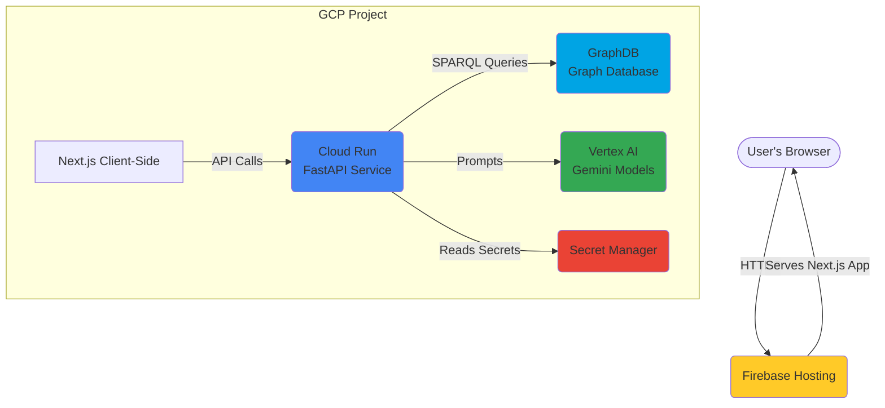

Of course. Here is the complete Fullstack Architecture Document for the "Grape" project.

---

### **Grape Fullstack Architecture Document**

### **Introduction**

This document outlines the complete fullstack architecture for Grape, including backend systems, frontend implementation, and their integration. It serves as the single source of truth for AI-driven development, ensuring consistency across the entire technology stack.

#### **Starter Template or Existing Project**

This is a greenfield project being built from scratch. No existing starter templates will be used for the overall monorepo structure, allowing us to define a clean architecture tailored specifically to the project's needs. However, the individual packages for the frontend (Next.js) and backend (FastAPI) will be initialized using their standard, official CLI tools (e.g., `create-next-app`) to ensure best practices are followed from the outset.

#### **Change Log**

| Date | Version | Description | Author |
| :--- | :--- | :--- | :--- |
|      | 1.0     | Initial Draft | Winston, Architect |

### **High Level Architecture**

#### **Technical Summary**

The Grape application will be a modern full-stack web application built within a monorepo. The architecture is designed for scalability and rapid development on the Google Cloud Platform. The frontend is a server-side rendered (SSR) Next.js application, providing a fast and interactive user experience. The backend is a serverless API built with Python and FastAPI, deployed on Cloud Run, which handles all business logic, AI integration, and data manipulation. The core of the system is a managed graph database, **GraphDB**, which communicates with the backend. All AI-powered features will leverage Google's Vertex AI platform.

#### **Platform and Infrastructure Choice**

*   **Platform:** Google Cloud Platform (GCP)
*   **Key Services:**
    *   **Cloud Run:** To host the containerized FastAPI backend services, providing a scalable, serverless environment.
    *   **Firebase Hosting:** To deploy and host the static and server-rendered assets of the Next.js frontend globally.
    *   **GraphDB on GCP Marketplace:** A managed graph database service to handle all knowledge graph storage, RDF compliance, and SPARQL queries.
    *   **Vertex AI (Gemini Models):** For all LLM-driven tasks, including graph generation, natural language command processing, and question-to-SPARQL conversion.
    *   **Google Secret Manager:** For securely storing all API keys, database credentials, and other sensitive information.
    *   **Artifact Registry:** To store the container images for our FastAPI services.

#### **Repository Structure**

*   **Structure:** Monorepo
*   **Monorepo Tool:** We will use `npm workspaces` for its simplicity and native support within the Node.js ecosystem.
*   **Package Organization:**
    *   `apps/web`: The Next.js frontend application.
    *   `apps/api`: The FastAPI backend application.
    *   `packages/shared-types`: A shared TypeScript package for data structures and types used by both the frontend and backend to ensure consistency.

#### **High Level Architecture Diagram**



#### **Architectural Patterns**

*   **Monorepo:** A single repository will house all code, simplifying dependency management and cross-application consistency.
*   **Serverless API:** By using Cloud Run, our backend benefits from automatic scaling (including scale-to-zero) and reduced operational management, which is ideal for a project with variable workloads.
*   **Component-Based UI:** The Next.js frontend will be built using reusable React components, promoting maintainability and a consistent user experience.
*   **Repository Pattern (Backend):** The FastAPI backend will use the repository pattern. This will create a clean separation between the business logic (services) and the data access logic (repositories that handle SPARQL queries to GraphDB), making the application easier to test and maintain.

### **Tech Stack**

This table outlines the complete technology stack for the Grape project. All development must adhere to these choices to ensure consistency and stability. Development should use the latest stable versions of these technologies.

| Category | Technology | Purpose & Rationale |
| :--- | :--- | :--- |
| **Frontend Language** | TypeScript | **Standard for Next.js.** Provides strong typing to reduce errors between frontend/backend. |
| **Frontend Framework** | Next.js | **User Specified.** Excellent for building fast, server-side rendered React applications. |
| **Graph Visualization**| react-force-graph | **User Specified.** Provides the core interactive graph visualization component. |
| **UI Component Library**| shadcn/ui | **User Specified & Modern.** A highly composable and accessible component library built on Tailwind CSS, enabling rapid and beautiful UI development. |
| **State Management** | Zustand | **Simplicity & Performance.** A lightweight, modern state management library for React that is simple to use and performant. |
| **Backend Language** | Python | **AI/NLP Standard.** Best ecosystem for AI, NLP, and data processing tasks required for the project. |
| **Backend Framework** | FastAPI | **User Specified.** High-performance Python framework for building modern, asynchronous APIs. |
| **API Style** | REST | **Standard & Simple.** FastAPI's primary style. Well-understood and easy to consume. |
| **Database** | GraphDB | **User Specified.** An enterprise-grade RDF graph database that supports the required SPARQL queries. |
| **Infrastructure as Code**| Terraform | **Industry Standard.** Allows for reliable and repeatable provisioning of all GCP resources as code. |
| **CI/CD** | Google Cloud Build | **GCP Native.** Tightly integrated with the GCP ecosystem for automated builds, testing, and deployments. |
| **Frontend Testing** | Jest & RTL | **Next.js Standard.** Jest for test running and React Testing Library for component testing. |
| **Backend Testing** | Pytest | **Python Standard.** A mature and powerful testing framework for Python applications. |
| **E2E Testing** | Playwright | **Modern & Reliable.** A modern end-to-end testing library that is fast and reliable. |
| **Styling** | Tailwind CSS | **Core for shadcn/ui.** A utility-first CSS framework that allows for building custom designs quickly without writing custom CSS. |

### **Data Models**

The following data models define the core entities of the Grape application. The TypeScript interfaces are the canonical representation and will be shared between the frontend and backend.

#### **Model: KnowledgeGraph**
*   **Purpose:** Represents a single, self-contained knowledge graph project.
*   **TypeScript Interface (`packages/shared-types/src/index.ts`):**
    ```typescript
    export interface KnowledgeGraph {
      id: string;
      name: string;
      createdAt: string; // ISO 8601 date string
      updatedAt: string; // ISO 8601 date string
    }
    ```

#### **Model: GraphNode**
*   **Purpose:** Represents an entity or concept within a knowledge graph.
*   **TypeScript Interface (`packages/shared-types/src/index.ts`):**
    ```typescript
    export interface GraphNode {
      id: string;
      label: string;
      properties: Record<string, any>; // Flexible object for any other data
    }
    ```

#### **Model: GraphLink**
*   **Purpose:** Represents a directed, semantic relationship between two nodes.
*   **TypeScript Interface (`packages/shared-types/src/index.ts`):**
    ```typescript
    export interface GraphLink {
      id: string;
      source: string; // ID of the source GraphNode
      target: string; // ID of the target GraphNode
      label: string;
      properties: Record<string, any>;
    }
    ```

### **API Specification**

```yaml
openapi: 3.0.0
info:
  title: "Grape API"
  version: "1.0.0"
  description: "API for creating, managing, and querying knowledge graphs in the Grape application."
servers:
  - url: "/api"
    description: "Main API endpoint"

paths:
  # == Epic 1: Foundation ==
  /import/rdf:
    post:
      summary: "Import Knowledge Graph from RDF file"
      tags: [Import/Export]
      requestBody:
        required: true
        content:
          multipart/form-data:
            schema:
              type: object
              properties:
                file:
                  type: string
                  format: binary
      responses:
        "200":
          description: "Successful import"
          content:
            application/json:
              schema:
                type: object
                properties:
                  graphId: { type: string }
        "400":
          description: "Invalid file format or validation error"

  # == Epic 2: Visualization & Editing ==
  /graph/{graph_id}:
    parameters:
      - in: path
        name: graph_id
        required: true
        schema: { type: string }
    get:
      summary: "Get graph data for visualization"
      tags: [Graph Management]
      responses:
        "200":
          description: "Graph data"
          content:
            application/json:
              schema:
                type: object
                properties:
                  nodes:
                    type: array
                    items: { $ref: '#/components/schemas/GraphNode' }
                  links:
                    type: array
                    items: { $ref: '#/components/schemas/GraphLink' }
        "404":
          description: "Graph not found"

  /graph/{graph_id}/node:
    parameters:
      - in: path
        name: graph_id
        required: true
        schema: { type: string }
    post:
      summary: "Create a new node"
      tags: [Graph Management]
      requestBody:
        required: true
        content:
          application/json:
            schema: { $ref: '#/components/schemas/GraphNode' }
      responses:
        "201":
          description: "Node created successfully"
          content:
            application/json:
              schema: { $ref: '#/components/schemas/GraphNode' }

  /graph/{graph_id}/node/{node_id}:
    parameters:
      - in: path
        name: graph_id
        required: true
        schema: { type: string }
      - in: path
        name: node_id
        required: true
        schema: { type: string }
    patch:
      summary: "Update an existing node"
      tags: [Graph Management]
      requestBody:
        required: true
        content:
          application/json:
            schema:
              type: object
              properties:
                label: { type: string }
                properties: { type: object }
      responses:
        "200":
          description: "Node updated successfully"
          content:
            application/json:
              schema: { $ref: '#/components/schemas/GraphNode' }
    delete:
      summary: "Delete a node"
      tags: [Graph Management]
      responses:
        "204":
          description: "Node deleted successfully"

  /graph/{graph_id}/link:
    parameters:
      - in: path
        name: graph_id
        required: true
        schema: { type: string }
    post:
      summary: "Create a new link"
      tags: [Graph Management]
      requestBody:
        required: true
        content:
          application/json:
            schema: { $ref: '#/components/schemas/GraphLink' }
      responses:
        "201":
          description: "Link created successfully"
          content:
            application/json:
              schema: { $ref: '#/components/schemas/GraphLink' }

  /graph/{graph_id}/link/{link_id}:
    parameters:
      - in: path
        name: graph_id
        required: true
        schema: { type: string }
      - in: path
        name: link_id
        required: true
        schema: { type: string }
    delete:
      summary: "Delete a link"
      tags: [Graph Management]
      responses:
        "204":
          description: "Link deleted successfully"
          
  # == Epic 3: AI-Powered Features ==
  /generate/graph:
    post:
      summary: "Generate a graph from a PDF or URL"
      tags: [AI Services]
      requestBody:
        content:
          application/json:
            schema:
              type: object
              properties:
                url: { type: string }
      responses:
        "200":
          description: "Successful generation"
          content:
            application/json:
              schema:
                type: object
                properties:
                  graphId: { type: string }

  /graph/{graph_id}/edit-ai:
    parameters:
      - in: path
        name: graph_id
        required: true
        schema: { type: string }
    post:
      summary: "Edit graph with a natural language command"
      tags: [AI Services]
      requestBody:
        required: true
        content:
          application/json:
            schema:
              type: object
              properties:
                command: { type: string }
      responses:
        "200":
          description: "Command executed successfully"
          content:
            application/json:
              schema:
                type: object
                properties:
                  message: { type: string }
      
  /graph/{graph_id}/query-agent:
    parameters:
      - in: path
        name: graph_id
        required: true
        schema: { type: string }
    post:
      summary: "Query the graph with the Gentoo KGBot"
      tags: [AI Services]
      requestBody:
        required: true
        content:
          application/json:
            schema:
              type: object
              properties:
                question: { type: string }
                contextNodeIds:
                  type: array
                  items: { type: string }
      responses:
        "200":
          description: "Agent's response"
          content:
            application/json:
              schema: { $ref: '#/components/schemas/AgentResponse' }

components:
  schemas:
    GraphNode:
      type: object
      properties:
        id: { type: string }
        label: { type: string }
        properties: { type: object }
    GraphLink:
      type: object
      properties:
        id: { type: string }
        source: { type: string }
        target: { type: string }
        label: { type: string }
        properties: { type: object }
    AgentResponse:
      type: object
      properties:
        answer: { type: string }
        reasoningPath:
          type: object
          properties:
            nodes:
              type: array
              items: { $ref: '#/components/schemas/GraphNode' }
            links:
              type: array
              items: { $ref: '#/components/schemas/GraphLink' }
```

### **Components**

The Grape application is composed of several key logical components with distinct responsibilities.

*   **Component: Frontend Application (Next.js)**
    *   **Responsibility:** Provides the complete user interface, manages client-side state, and communicates with the backend API.
    *   **Technology Stack:** Next.js, React, TypeScript, `react-force-graph`, `shadcn/ui`, Tailwind CSS, Zustand.
*   **Component: Backend API Service (FastAPI)**
    *   **Responsibility:** Exposes the REST API, orchestrates all business logic, and serves as the intermediary between the frontend, database, and AI services.
    *   **Technology Stack:** Python, FastAPI.
*   **Component: Graph Database Interface (Repository)**
    *   **Responsibility:** An internal backend component that abstracts all communication with GraphDB, translating service-layer requests into SPARQL queries.
    *   **Technology Stack:** Python, RDFLib.
*   **Component: AI Services**
    *   **Responsibility:** A logical grouping of AI-powered capabilities within the backend that handle graph generation, AI-assisted editing, and natural language querying via Vertex AI.
    *   **Technology Stack:** Python, Google Cloud AI Platform libraries.

#### **Component Diagrams**

```mermaid
graph TD
    subgraph User's Device
        A[Frontend Application<br/>(Next.js on Browser)]
    end

    subgraph GCP
        B[Backend API Service<br/>(FastAPI on Cloud Run)]
        C[Graph Database<br/>(GraphDB)]
        D[AI Models<br/>(Vertex AI)]
    end

    A -- REST API Calls --> B
    B -- SPARQL Queries --> C
    B -- Prompts / LLM Calls --> D
```

### **Unified Project Structure**

```plaintext
grape-monorepo/
├── apps/
│   ├── api/                  # FastAPI Backend Application
│   │   ├── app/
│   │   │   ├── main.py
│   │   │   ├── api/
│   │   │   │   └── v1/
│   │   │   │       └── routers/
│   │   │   ├── core/
│   │   │   ├── schemas/
│   │   │   ├── services/
│   │   │   └── repositories/
│   │   ├── tests/
│   │   ├── Dockerfile
│   │   └── requirements.txt
│   │
│   └── web/                  # Next.js Frontend Application
│       ├── app/
│       │   ├── (main)/
│       │   │   ├── dashboard/
│       │   │   └── project/{graphId}/
│       │   ├── globals.css
│       │   ├── layout.tsx
│       │   └── page.tsx
│       ├── components/
│       │   └── ui/
│       ├── lib/
│       ├── public/
│       └── package.json
│
├── packages/
│   ├── shared-types/
│   ├── eslint-config-custom/
│   └── tsconfig-custom/
│
├── infrastructure/
│   └── terraform/
│
├── package.json
└── README.md
```
