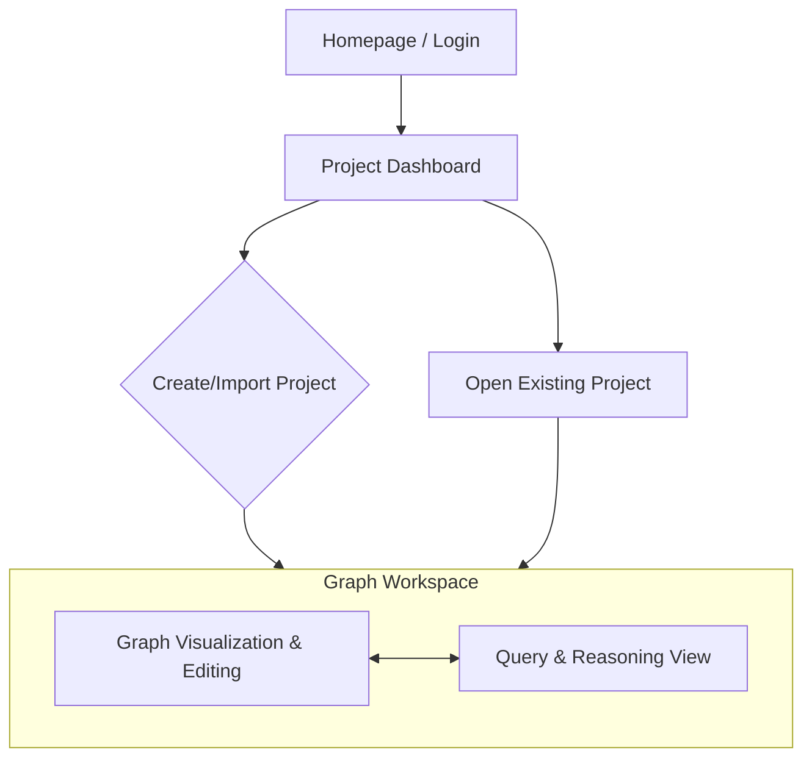

### **Grape UI/UX Specification**

### **Introduction**

This document defines the user experience goals, information architecture, user flows, and visual design specifications for Grape's user interface. It serves as the foundation for visual design and frontend development, ensuring a cohesive and user-centered experience.

#### **Overall UX Goals & Principles**

##### **Target User Personas**
*   **Researchers and Analysts:** Technical users who need power, efficiency, and the ability to map complex knowledge domains and find non-obvious connections.
*   **Students and Professionals:** Non-specialist users who prioritize ease of use, clear guidance, and the ability to get reliable, sourced answers without a steep learning curve.
*   **AI Developers:** Expert users who require deep transparency into the AI's reasoning for debugging, analysis, and validation purposes.

##### **Usability Goals**
*   **Ease of Learning:** A new user should be able to import or generate their first graph and ask a basic query within 5 minutes of their first use.
*   **Efficiency of Use:** An experienced researcher should be able to perform complex manipulations and queries with a minimum of steps.
*   **Error Prevention:** The interface will provide clear confirmations before any destructive actions (e.g., deleting nodes) and offer helpful guidance.
*   **Memorability:** A student returning after a week should be able to pick up where they left off without needing to relearn the core functions.

##### **Design Principles**
1.  **Clarity Above All:** Prioritize clear information display and unambiguous interactions over decorative aesthetics. The data is the hero.
2.  **Progressive Disclosure:** Start simple. Show core functions first and reveal more advanced tools and options contextually, preventing overwhelm.
3.  **Immediate Visual Feedback:** Every user action—manual or AI-driven—should result in a clear and immediate visual change, reinforcing a sense of control and understanding.
4.  **Consistency is Key:** Use consistent patterns for interaction, layout, and terminology throughout the application to build user confidence and speed up learning.

#### **Change Log**

| Date | Version | Description | Author |
| :--- | :--- | :--- | :--- |
|      | 1.0     | Initial Draft | Youssef Mehil |

### **Information Architecture (IA)**

#### **Site Map / Screen Inventory**



#### **Navigation Structure**

*   **Primary Navigation:** After logging in, the user lands on the **Project Dashboard**. A persistent link or icon (using the Grape logo) will always return the user to this dashboard.
*   **In-Workspace Navigation:** Within the **Graph Workspace**, a prominent tab system will allow users to toggle between the `Graph Visualization & Editing` view and the `Query & Reasoning View`.
*   **Breadcrumb Strategy:** A breadcrumb trail (e.g., `Dashboard > [Project Name]`) will be displayed at the top of the Graph Workspace.

### **User Flows**

#### **Flow: Import an Existing Knowledge Graph (RDF)**
*   **User Goal:** To upload a pre-existing RDF file and see it visualized in the workspace.
*   **Diagram:**
    ```mermaid
    graph TD
        A[Start: Project Dashboard] --> B{Click 'Import RDF'};
        B --> C[System: Show File Dialog];
        C --> D{User: Selects a file};
        D -- RDF file selected --> E[System: Show 'Uploading & Processing...' state];
        E --> F{API: Validate & Store Graph};
        F -- Success --> G[System: Navigate to Graph Workspace];
        G --> H[End: Graph is visualized];
        F -- Failure --> I[System: Show 'Error: Invalid file or upload failed' message];
        I --> A;
    ```

#### **Flow: Generate Graph from a Document (PDF/URL)**
*   **User Goal:** To provide a document or URL and have the AI automatically create and visualize a new knowledge graph.
*   **Diagram:**
    ```mermaid
    graph TD
        A[Start: Project Dashboard] --> B{Select 'Create from PDF' or 'Create from URL'};
        B --> C[System: Show input dialog for file/URL];
        C --> D{User provides source};
        D --> E[System: Show multi-step progress feedback<br/>(e.g., 'Uploading...', 'Analyzing document...')];
        E --> F{API: Send source to LLM for analysis};
        F --> G{API: Process LLM response & build graph};
        G --> H{API: Store new graph in database};
        H -- Success --> I[System: Navigate to Graph Workspace];
        I --> J[End: New graph is visualized];
        H -- Failure --> K[System: Show specific error message];
        K --> A;
    ```

#### **Flow: Querying the Graph with the Agent**
*   **User Goal:** To ask a question and receive a verifiable answer with a visual representation of the AI's reasoning.
*   **Diagram:**
    ```mermaid
    graph TD
        A[Start: Query & Reasoning View] --> B{User types question and submits};
        B --> C[System: Display question in chat & show 'Thinking...' indicator];
        C --> D{API: Send question to query-agent endpoint};
        D --> E{Backend: LLM generates SPARQL & queries graph};
        E -- Results found --> F[API: Return text answer & reasoning path data];
        F --> G[System: Display text answer in chat];
        G --> H[System: Dynamically render reasoning path graph];
        H --> I[System: Simultaneously highlight path in main graph];
        I --> J[End: User sees answer and full visual context];
        E -- No results --> K[API: Return 'Answer not found' message];
        K --> L[System: Display 'I could not find an answer in the knowledge graph' in chat];
        L --> J;
    ```

### **Wireframes & Mockups**

#### **Primary Design Source**
There will be no external design files (e.g., Figma). This UI/UX Specification serves as the single source of truth for the application's visual and interaction design.

#### **Key Screen Layouts**
*   **Screen: Project Dashboard**
    *   **Purpose:** Central hub to manage knowledge graph projects.
    *   **Key Elements:** Header with logo, Primary Actions ("Create from PDF," "Import RDF"), Project List (grid/list), Search Bar.
*   **Screen: Graph Workspace**
    *   **Purpose:** Focused environment for working with a single knowledge graph.
    *   **Key Elements:** Top Bar (Breadcrumb, AI-edit command), Main Content Area with a Tab switcher ("Graph View", "Query View").
    *   **"Graph View":** Main Panel (Graph visualization), Side Panel (Inspector for selected node/link).
    *   **"Query View":** Chat Panel, Reasoning Panel (for reasoning path graph).

### **Component Library / Design System**

#### **Design System Approach**
A small, project-specific component library will be built in Next.js to ensure consistency and speed up development.

#### **Core Components**
*   **Button:** Variants for Primary, Secondary, Destructive actions; states for Default, Hover, Pressed, Disabled.
*   **Input Field:** For text entry; variants for Standard, With Icon; states for Default, Focused, Error, Disabled.
*   **Panel/Card:** Container for UI sections.
*   **Tabs:** To switch between "Graph View" and "Query View".
*   **Modal/Dialog:** For confirmation prompts.
*   **Loading Spinner/Indicator:** For visual feedback during async operations.

### **Branding & Style Guide**

#### **Visual Identity**
The provided Grape logo is the central branding element.

#### **Color Palette**
| Color Type | Hex Code | Usage |
| :--- | :--- | :--- |
| Primary/Accent | `#E57373` | Primary buttons, active elements |
| Background | `#FDFDFD` | Main app background |
| Panel Background| `#FFFFFF` | Panels and cards |
| Text (Primary) | `#1C1C1C` | Primary body text |
| Text (Secondary)| `#6B7280` | Secondary text, labels |
| Borders/Lines | `#E5E7EB` | Borders and dividers |
| Success | `#10B981` | Success messages |
| Warning | `#F59E0B` | Warnings |
| Error/Destructive| `#EF4444` | Errors, destructive actions |

#### **Typography**
*   **Primary Font Family:** Inter (or similar modern sans-serif).
*   **Monospace Font Family:** Roboto Mono (or similar).

##### **Type Scale**
| Element | Size | Weight |
| :--- | :--- | :--- |
| H1 | 36px | Bold (700) |
| H2 | 24px | Bold (700) |
| H3 | 20px | Semi-Bold (600) |
| Body | 16px | Regular (400) |
| Small | 14px | Regular (400) |

#### **Iconography**
*   **Icon Library:** Material Symbols (from Google).

#### **Spacing & Layout**
*   **Grid System:** 8-point grid system for all spacing and sizing.

### **Accessibility Requirements**

*   **Compliance Target:** WCAG 2.1 Level AA.
*   **Key Requirements:** High-contrast text, visible focus indicators, keyboard navigability, screen reader support, and proper form labeling.

### **Responsiveness Strategy**

*   **Breakpoints:** Mobile (320px+), Tablet (768px+), Desktop (1024px+).
*   **Adaptation Patterns:** A simplified, query-focused view for mobile. A full-featured, multi-panel layout for tablet and desktop.
